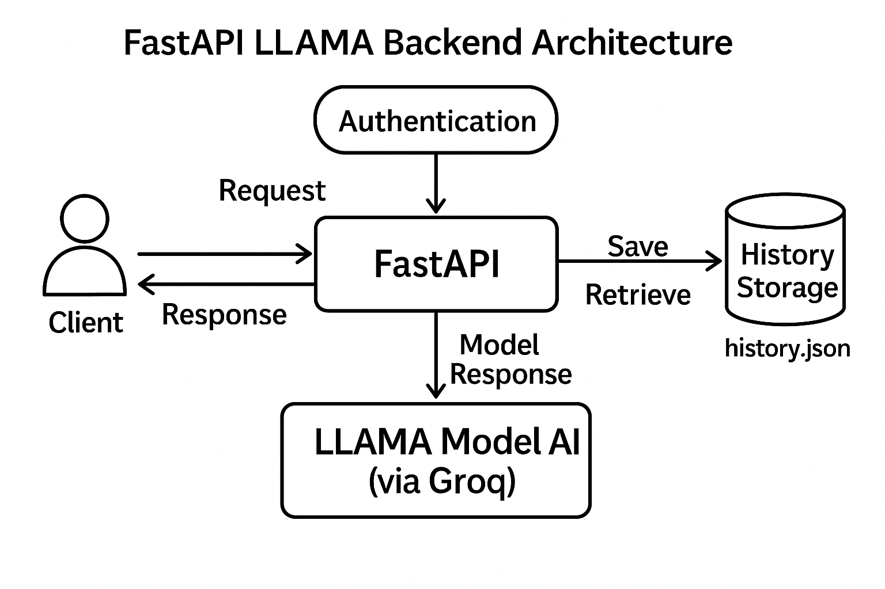

# FastAPI  AI Backend  

This is a FastAPI-based backend application that allows authenticated users to submit prompts, sends them to the AI model (using Groq API), returns the generated response, and stores complete user prompt history locally.

---

##  Features

✔ Token-based authentication (Bearer Token)  
✔ `/login` – Validates user credentials and returns token  
✔ `/prompt` – Sends prompt to  AI (Groq API) and returns response  
✔ `/history` – Returns user's previous submission history  
✔ Prompt history stored in JSON/in-memory  
✔ FastAPI Swagger UI support  
✔ Clean modular code structure  

---

## 🛠 Tech Stack

| Tool | Purpose |
|------|---------|
| FastAPI | Backend framework |
| Python 3.8+ | Programming language |
| Pydantic | Validation models |
| Uvicorn | ASGI server |
| Groq API  | AI model integration |
| JSON / Dictionary | History storage |

---

## Project Setup

### 1️⃣ Clone the Project
```bash
git clone <your-repository-url>
cd fastapi-ai-backend
```

### 2️⃣ Create Virtual Environment
```bash
python -m venv venv
venv\Scripts\activate
```

### 3️⃣ Install Dependencies
```bash
pip install -r requirements.txt
```

### 4️⃣ Add Groq API Key  
Create a `.env` file in the root folder and add:
```
GROQ_API_KEY=your_actual_groq_api_key_here
```

### 5️⃣ Run the Project
```bash
uvicorn main:app --reload
```

---

## 🧪 API Testing — Swagger UI

After starting the server, visit:  
👉 http://localhost:8000/docs

---

## 🔑 Authentication

### Default Login Credentials
| Username | Password |
|----------|----------|
| shrey | password123 |
| test | test123 |

---

## 📮 API Endpoints

| Method | Endpoint | Description | Auth Required |
|--------|----------|-------------|---------------|
| POST | `/login/` | User login, returns token | ❌ No |
| POST | `/prompt/` | Send prompt, returns AI response | ✔ Yes |
| GET | `/history/` | Get previous prompts and responses | ✔ Yes |

---

### 🔐 1️⃣ POST /login/

**Request:**
```json
{
  "username": "shrey",
  "password": "password123"
}
```

**Response:**
```json
{
  "access_token": "<token>",
  "token_type": "bearer"
}
```

---

### 💬 2️⃣ POST /prompt/

**Headers:**
```
Authorization: Bearer <token>
```

**Request:**
```json
{
  "prompt": "What is Python?"
}
```

**Response:**
```json
{
  "prompt": "What is Python?",
  "response": "Python is an interpreted high-level programming language...",
  "timestamp": "2025-11-19T10:45:56"
}
```

---

### 🕘 3️⃣ GET /history/

**Response:**
```json
{
  "history": [
    {
      "prompt": "What is API?",
      "response": "API stands for Application Programming Interface...",
      "timestamp": "2025-11-19T09:10:22"
    }
  ]
}
```

---

## ⚠ Error Handling

| Error Code | Meaning |
|------------|---------|
| 401 | Invalid/expired token |
| 403 | Not authenticated |
| 422 | Invalid input |
| 502 | AI API failure |

---

## 📁 Folder Structure

```
project/
│── main.py
│── auth.py
│── schemas.py
│── requirements.txt
│── history.json
│── .env
│
├── services/
│   └── alternate_service.py
│
├── storage/
│   ├── history.py

```

---
### 🏗️ Architecture Diagram




